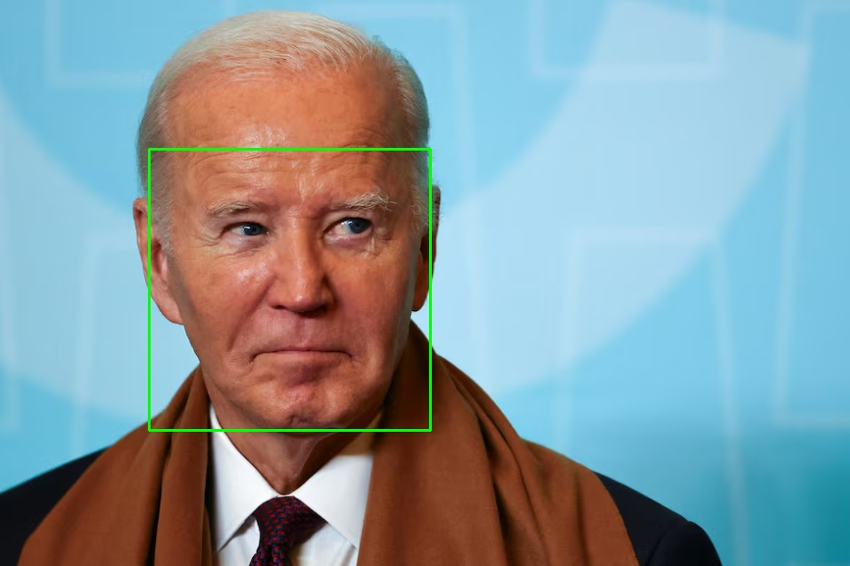
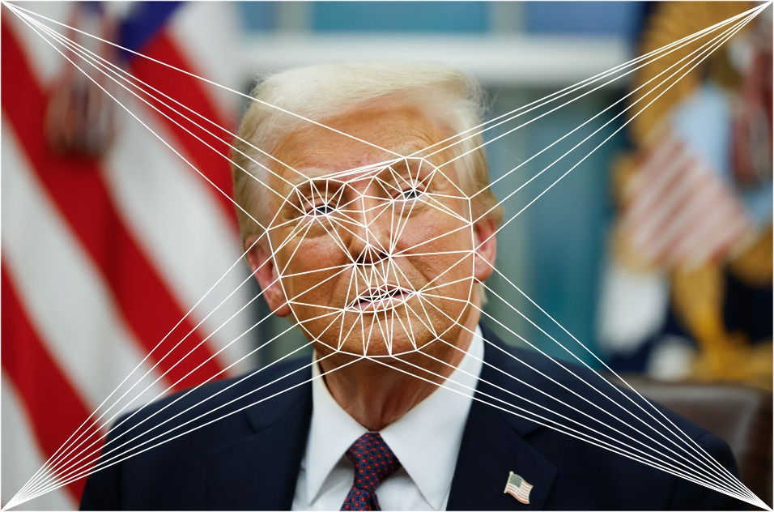
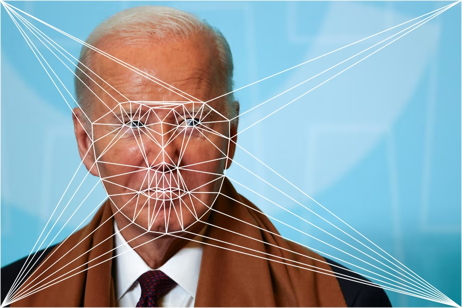
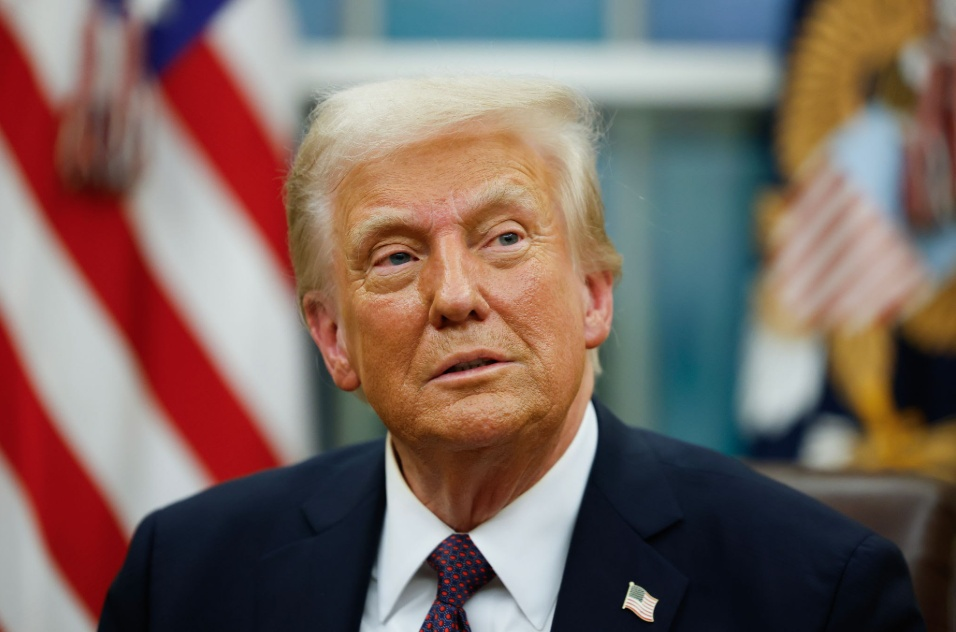
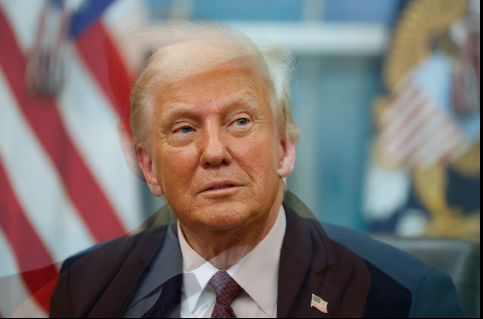
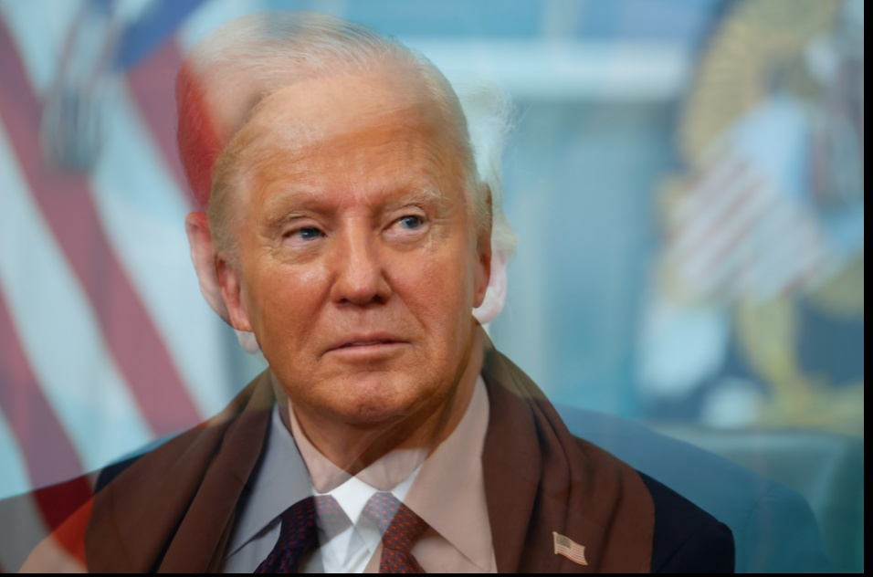
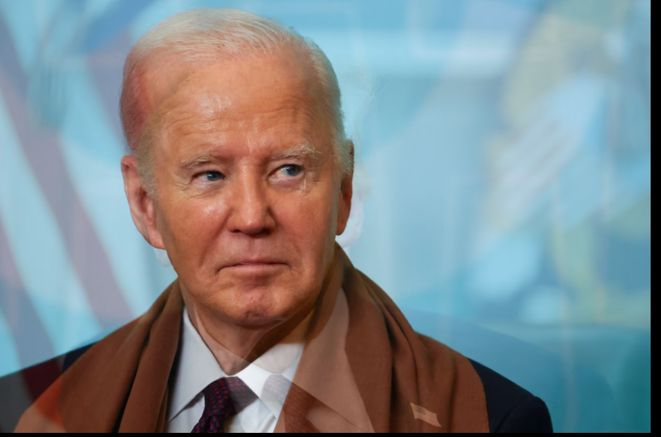
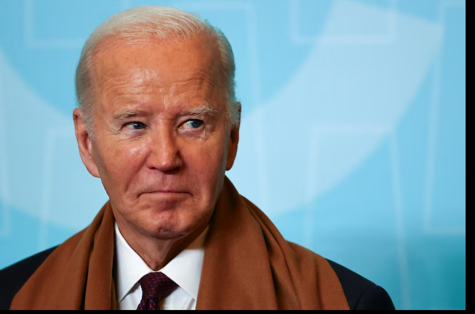

# delauney-image-morphing #
This project implements a face morphing algorithm using OpenCV, dlib, and Python. The pipeline utilizes facial landmark detection, Delaunay triangulation, and affine transformations to seamlessly morph one face into another.

Below is the step-by-step breakdown of the implementation.

# Facial Landmark Detection
We first identify the face geometry using Dlib's 68-point predictor. We also manually append the image corners to the landmark list so the background warps along with the face.
```
def landmark_generator(point_list, img):
    # Define the image copy to not affect the original image
    img_copy = img.copy()

    # Load the Detector(Face Finder)
    detector = dlib.get_frontal_face_detector()

    # Load the predictor
    predictor = dlib.shape_predictor("shape_predictor_68_face_landmarks.dat")

    # Convert image to grayscale (Detectors work on gray images)
    gray = cv.cvtColor(img, cv.COLOR_BGR2GRAY)

    # Find faces
    faces = detector(gray)

    # Create a copy so we don't draw on the original image yet
    img_faces = img.copy()

    # Read in the points from a text file
    for i, face in enumerate(faces):
      # Visualize detected face
      x1 = face.left()
      y1 = face.top()
      x2 = face.right()
      y2 = face.bottom()

      # Draw the rectangle (Green color, thickness 2)
      cv2.rectangle(img_faces, (x1, y1), (x2, y2), (0, 255, 0), 2)

      # Get the landmarks
      landmarks = predictor(gray, face)

      # Loop through the 68(because of the .dat model we use) points and add them to your list
      for n in range(0, 68):
        x = landmarks.part(n).x
        y = landmarks.part(n).y
        point_list.append((x, y))

    # Append corner points of the image
    point_list.append((0, 0))
    point_list.append((img.shape[1] - 1, 0))
    point_list.append((0, img.shape[0] - 1))
    point_list.append((img.shape[1] - 1, img.shape[0] - 1))

    # Show the result
    img_faces = cv2.cvtColor(img_faces, cv2.COLOR_BGR2RGB)
    cv2_imshow(img_faces)

    return point_list, img_copy
```




# Delaunay Triangulation
To avoid "ghosting," we divide the face into triangles. The indices of these triangles are synchronized between both images; if the left eye is Triangle #45 in Image A, it must also be Triangle #45 in Image B.
```
def delaunay_triangulation(img, points):
  # Create a rectangle that bounds the image
  bounding_rect = (0, 0, img.shape[1], img.shape[0])

  # Create a new Subdiv2D object using the bounding rectangle
  subdiv = cv2.Subdiv2D(bounding_rect)

  # Insert the landmark points into the Subdiv2D object
  subdiv.insert(points)

  # Get a list of triangles from the Subdiv2D object
  triangle_list = subdiv.getTriangleList()

  # Create a dictionary that maps each landmark point to its index in the points list
  point_index_dict = {(p[0], p[1]): i for i, p in enumerate(points)}

  # Create a list of triangles where each triangle is represented as a list of three point indices
  triangle_indices = []
  for triangle in triangle_list:
    # Extract the indices of the three points that made up the tirangle
    point_indices = (point_index_dict[(triangle[0], triangle[1])],
                     point_index_dict[(triangle[2], triangle[3])],
                     point_index_dict[(triangle[4], triangle[5])])
    triangle_indices.append(point_indices)

  # Return the list of triangle indices
  return triangle_indices, subdiv
```





# Affine Warping & Alpha Blending
Once the triangles are defined, we need to warp the pixel content from the source shapes to the new intermediate shape. This function handles the math for a single triangle.
```
def compute_morphed_triangle(triangle1, triangle2, triangle, alpha):
    # Find the bounding box of the destination triangle
    r = cv2.boundingRect(triangle)
    x, y, w, h = r

    # Normalize destination points relative to patch
    t_offset = triangle - [x, y]

    # Create the mask for the patch
    mask = np.zeros((h, w, 3), dtype=np.uint8)
    cv2.fillConvexPoly(mask, t_offset.astype(np.int32), (255, 255, 255), 16, 0)

    # Calculate affine transforms
    t1_float = np.float32(triangle1)
    t2_float = np.float32(triangle2)
    t_offset_float = np.float32(t_offset)

    M1 = cv2.getAffineTransform(t1_float, t_offset_float)
    M2 = cv2.getAffineTransform(t2_float, t_offset_float)

    # Warp the full source images
    warp_triangle1 = cv2.warpAffine(
        img1, M1, (w, h)
    )

    warp_triangle2 = cv2.warpAffine(
        img2, M2, (w, h)
    )

    # Blend and mask
    morphed_triangle = (1.0 - alpha) * warp_triangle1 + alpha * warp_triangle2
    morphed_triangle = np.uint8(morphed_triangle)

    # Normalize mask to 0-1
    mask_float = mask / 255.0

    # Paste into result and cut out the background
    result[y:y+h, x:x+w] = result[y:y+h, x:x+w] * (1.0 - mask_float)
    # Add the triangle
    result[y:y+h, x:x+w] += (morphed_triangle * mask_float).astype(np.uint8)

    return None, None, None
```

- **Bounding Box & Masking:** We isolate the specific triangle area to avoid processing the entire image for every single triangle.
- **Affine Transform:** `cv2.getAffineTransform` computes the matrix needed to skew/rotate the source triangle to match the destination.
- **Alpha Blending:** We blend the pixel values based on alpha. If `alpha = 0.5`, we take 50% of the pixel intensity from Image 1 and 50% from Image 2.

# Generating Static Morph Stages
We generate the morph by calculating a weighted average for both the shape (landmark positions) and the texture (pixel intensity). The `alpha` value controls the blend ratio.

```
def create_morph(alpha_list):
  global result

  # Create a list of triangle indices
  triangle_indices, subdiv = delaunay_triangulation(img1, points1)

  for alpha in alpha_list:
    # Reset the canvas for each new alpha value
    result = np.zeros_like(img1)

    # Calculate intermediate points using weighted average
    morphed_points = []

    for i in range(len(points1)):
      x = (1 - alpha) * points1[i][0] + alpha * points2[i][0]
      y = (1 - alpha) * points1[i][1] + alpha * points2[i][1]
      morphed_points.append((x, y))

    for idx, t in enumerate(triangle_indices):
      # Get the corresponding triangles in both images and morphed image
      triangle1 = np.array(
          [points1[t[0]], points1[t[1]], points1[t[2]]], dtype=np.float32
      )
      triangle2 = np.array(
          [points2[t[0]], points2[t[1]], points2[t[2]]], dtype=np.float32
      )
      triangle = np.array(
          [morphed_points[t[0]], morphed_points[t[1]], morphed_points[t[2]]], dtype=np.float32
      )

      # Calculate the morphed triangle and add to result
      (cropped_triangle_1, cropped_triangle_2, morphed_triangle) = compute_morphed_triangle(triangle1, triangle2, triangle, alpha)

    cv2_imshow(cv2.cvtColor(result, cv2.COLOR_BGR2RGB))

create_morph(alpha_list=[0.00, 0.25, 0.50, 0.75, 1.00])
```











# Dynamic Animation (GIF Creation)
To create a smooth animation, we generate 100 frames with linearly increasing alpha values.
```
def create_morph_gif(filename):
  global result

  # Create a list of triangle indices
  triangle_indices, subdiv = delaunay_triangulation(img1, points1)

  # Initialize empty list to store frames of the gif
  frames = []

  for alpha in np.linspace(0, 1, 100):
    # Calculate intermediate points using weighted average
    morphed_points = []

    for i in range(len(points1)):
      x = (1 - alpha) * points1[i][0] + alpha * points2[i][0]
      y = (1 - alpha) * points1[i][1] + alpha * points2[i][1]
      morphed_points.append((x, y))

    for idx, t in enumerate(triangle_indices):
      # Get the corresponding triangles in both images and morphed image
      triangle1 = np.array(
          [points1[t[0]], points1[t[1]], points1[t[2]]], dtype=np.float32
      )
      triangle2 = np.array(
          [points2[t[0]], points2[t[1]], points2[t[2]]], dtype=np.float32
      )
      triangle = np.array(
          [morphed_points[t[0]], morphed_points[t[1]], morphed_points[t[2]]], dtype=np.float32
      )

      # Calculate the morphed triangle and add to result
      (cropped_triangle_1, cropped_triangle_2, morphed_triangle) = compute_morphed_triangle(triangle1, triangle2, triangle, alpha)

    # Apply median filtering to the result and add it to the frames list
    frames.append(cv.medianBlur(result, 5))

    # Reset result for next iteration
    result = np.zeros_like(img1)

  # Save frames as a gif
  imageio.mimsave(filename, frames, duration=0.04)
```


